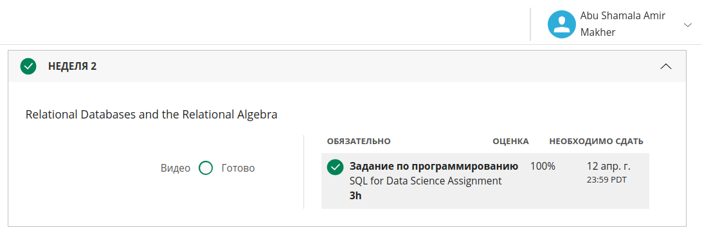

# week2

### Results:


### Queries
##### Problem 1:

```
.open reuters.db
``` 

a.
``` 
select count(*) from (
    select * from frequency where docid = '10398_txt_earn'
) x;
```

b.
```
select count(*) from (
    select term from frequency where docid = '10398_txt_earn' and count = 1
) x; 
```

c.
``` 
select count(*) from (
    select term from frequency where docid = '10398_txt_earn' and count = 1 UNION select term from frequency where docid = '925_txt_trade' and count = 1
) x;
``` 

d.
``` 
select count(*) from (
    select distinct docid from frequency where term = 'law' OR term = 'legal'
) x;
``` 

e.
``` 
select count(*) from (
    select docid, count(distinct term) as c from frequency group by docid having c > 300;   
) x;
``` 

f.
``` 
select count(*) from (
    select docid from frequency where term= 'transactions' intersect select docid from frequency where term= 'world';
) x;
``` 

##### Problem 2:
``` 
.open matrix.db
``` 

g.
``` 
select a.row_num, b.col_num, sum(a.value * b.value) from a, b where a.col_num = b.row_num group by a.row_num, b.col_num
``` 

##### Problem 3:
``` 
.open matrix.db
``` 

h.
``` 
select a.docid, b.docid, sum(a.count * b.count) from Frequency a , Frequency b on a.term = b.term where a.docid = '10080_txt_crude' and b.docid = '17035_txt_earn' group by a.docid, a.docid;
``` 

i.
``` 
CREATE VIEW table1 AS
SELECT * FROM frequency
UNION
SELECT 'q' as docid, 'washington' as term, 1 as count 
UNION
SELECT 'q' as docid, 'taxes' as term, 1 as count
UNION 
SELECT 'q' as docid, 'treasury' as term, 1 as count;

select A.docid, B.docid, sum(A.count * B.count) as similarity 
from table1  A, table1 B on A.term = B.term  
where A.docid = 'q' and B.docid != 'q'
group by A.docid, B.docid
order by similarity desc limit 10;
``` 


